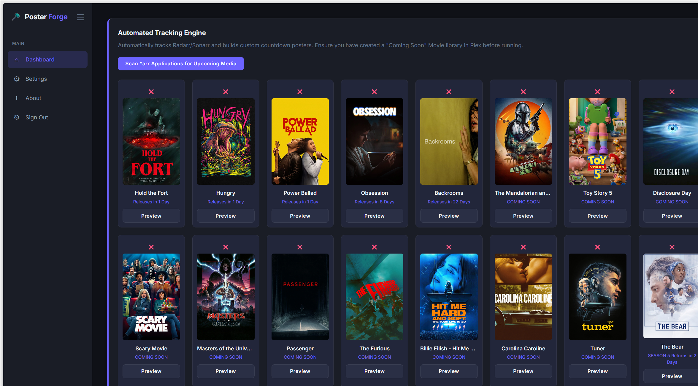
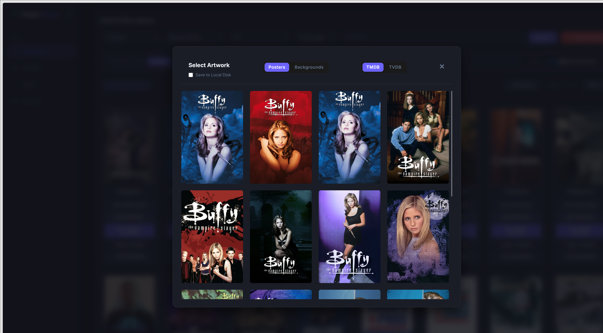
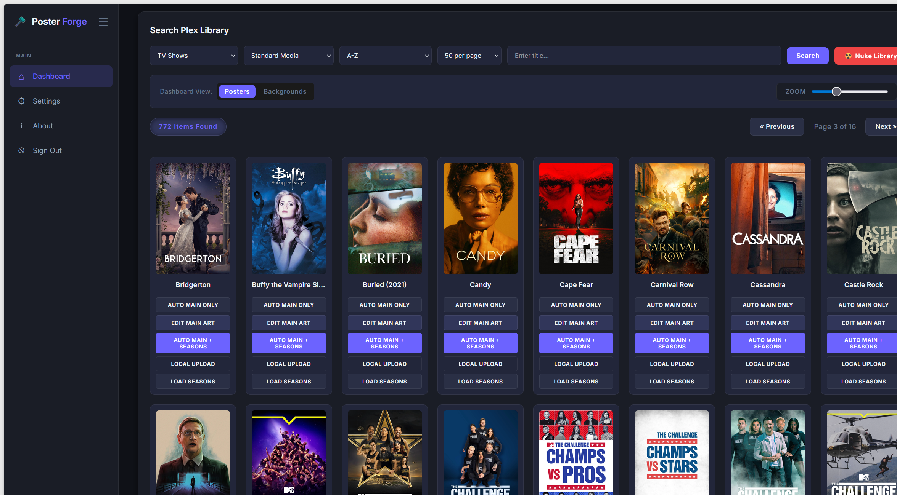
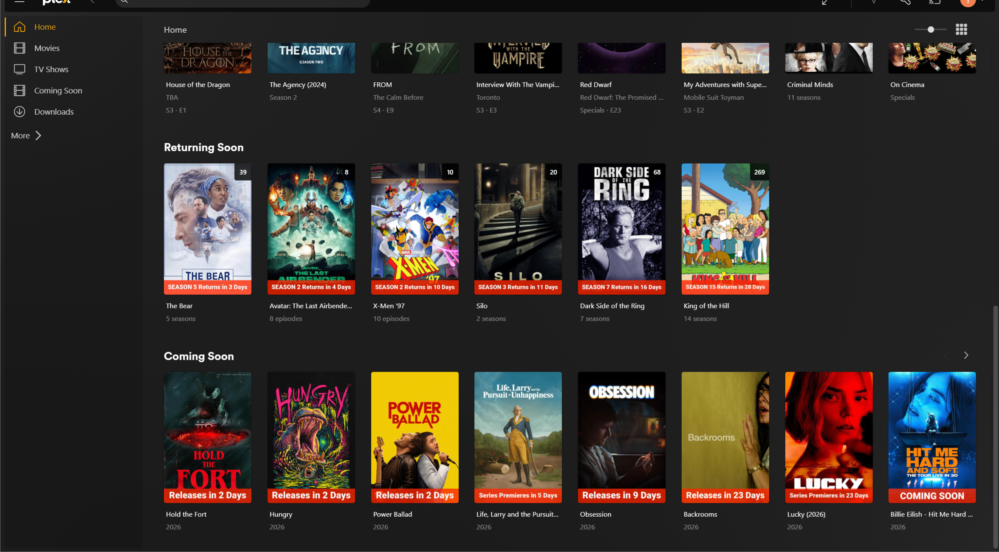

# Poster Forge

I built this app to address and simplify my two biggest wants in Plex management: poster management, and a "Coming Soon" hub displayed directly on my home page. While there are other tools out there that can accomplish this, I often found them to be too complex and overwrought for my needs. Poster Forge is designed so that once configured, you can accomplish these tasks lightning-fast with just a couple of button presses, or you can dive in and micromanage each individual item if you prefer.

This project was coded in concert with AI—which I know can be a polarizing topic right now—but I went out of my way to ensure the resulting application is secure, customizable, and exceptionally user-friendly.

## Screenshots

| Automated Tracking Engine | Poster Customization |
| :---: | :---: |
|  |  |
| **Plex Library Search** | **Plex Home Integration** |
|  |  |

## Features

### Poster Management
Poster Forge provides a poster replacement interface that can be tweaked on every level, showing you what has been changed in real-time. Load your library, choose your item, and take control. For a show, you can:
- Automatically replace all posters and backgrounds from your default source (TMDB or TVDB).
- Manually hand-pick each picture.
- Upload your own custom artwork with immediate visual feedback.

This makes it incredibly easy and fast to set up perfectly matching season cards. You can switch between image sources on the fly, or even process an entire library at once. There are plenty of configuration choices, including options to save backup images to your disk or exclude backgrounds.

### Automated Tracking Engine ("Coming Soon")
Poster Forge actively queries your *Arr stack for managed upcoming items and categorizes them into two distinct pipelines:

**1. Movies & New Series (The "Coming Soon" Library)**
Because new movies and unreleased TV shows do not exist on your hard drive yet, Plex cannot normally display them. Poster Forge bypasses this by physically downloading the latest high-quality trailer for the upcoming item and injecting it into Plex as a "fake" movie!
> [!IMPORTANT]
> **Required Setup:** You MUST create a dedicated Movie Library in Plex and name it exactly **Coming Soon**. You must also point it to a valid, writable folder on your hard drive. Poster Forge will automatically drop the trailers into this folder, paint a countdown banner on the poster, and group them into a "Coming Soon" collection.

**2. Returning Shows (The "Returning Soon" Collection)**
For TV shows that already exist on your server but are going into a new season, Poster Forge simply finds the existing show in your normal TV library, paints a "Returns in X Days" banner on its poster, and tags it with a **Returning Soon** collection.

**The Handoff**
The instant an item finally hits your library and is processed by Plex, Tautulli fires a webhook to Poster Forge. Poster Forge will immediately remove the "Coming Soon" banner, apply a clean poster, and—if it was a movie—automatically delete the fake trailer from your hard drive!

> [!TIP]
> **Plex Home Screen Visibility:** Plex does not automatically pin collections to your global home screen. To see the "Coming Soon" or "Returning Soon" hubs when you open Plex, navigate to the collection inside your library, edit it, go to the **Advanced** tab, and change the **Visible on** setting to **Library/Home/Friend's Home**!

**ImageMaid Integration:**
I also included the Kometa-Team's ImageMaid script, which you can launch with a single button from the UI. **USE THIS AT YOUR OWN RISK, AND PLEASE READ THEIR DOCUMENTATION FIRST:** [ImageMaid Documentation](https://kometa.wiki/en/latest/kometa/scripts/imagemaid/?h=image).

---

## Installation

Poster Forge is designed to run in Docker. Below is a standard `docker-compose.yml` configuration:

```yaml
version: '3.8'

services:
  poster_forge:
    image: yourdockerhubname/poster_forge:latest # Update this!
    container_name: poster_forge
    ports:
      - "8000:8000"
    volumes:
      # Data persistence (Settings, config, internal caches)
      - ./forge_data:/app/data
      
      # Optional: Persistent Logs
      - ./forge_logs:/app/logs
      
      # Map your Media, Plex Metadata, or Cache if you plan to use those features
      - /path/to/media:/media
      - "/path/to/plex/Plex Media Server:/plex:rw"
      - "/path/to/plex/Cache:/plex/Cache:rw"
    deploy:
      resources:
        limits:
          memory: 1G             
    environment:
      - TZ=America/Chicago
    restart: unless-stopped
```

## Configuration

Once the container is running, simply navigate to `http://<your-ip>:8000/settings` in your browser to configure the application.

1. **Authentication:** Set your Web UI Username and Password to secure your dashboard.
2. **API Keys:** Enter your TMDB, TVDB, Plex, Radarr, and Sonarr API keys.
3. **Webhook Token:** Click Generate in the Security section to create a secure token for Tautulli.

### Setting up Tautulli
If you want to automate Poster Forge based on Plex events, configure a Webhook in Tautulli:
1. Go to **Settings > Notification Agents > Add a new notification agent > Webhook**.
2. **Webhook URL:** `http://<poster-forge-ip>:8000/api/webhook/tautulli?token=YOUR_GENERATED_TOKEN`
3. **Webhook Method:** `POST`
4. **Triggers:** Select the triggers you want (e.g., "Recently Added").
5. **Data:** Configure the JSON payload exactly as expected by Poster Forge.

## License & Liability

This project is licensed under the **MIT License**.

> **Disclaimer:** Poster Forge is provided "as is", without warranty of any kind. The authors are not liable for any claims, damages, or data loss arising from the use of this software. Always back up your Plex metadata before applying automated artwork modifications.
